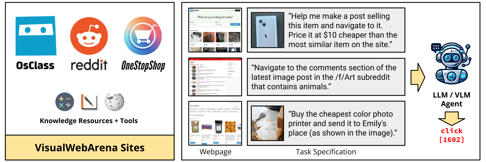

# VisualWebArena: Evaluating Multimodal Agents on Realistic Visual Web Tasks
<!-- <p align="center">
<a href="https://www.python.org/downloads/release/python-3109/"></a>
<a href="https://pre-commit.com/"></a>
<a href="https://github.com/psf/black"></a>
<a href="https://mypy-lang.org/"></a>
<a href="https://beartype.readthedocs.io"></a>
</p> -->

[<a href="https://jykoh.com/vwa">Website</a>] 
[<a href="https://arxiv.org/abs/2401.13649">Paper</a>]

<i>VisualWebArena</i> is a realistic and diverse benchmark for evaluating multimodal autonomous language agents. It comprises of a set of diverse and complex web-based visual tasks that evaluate various capabilities of autonomous multimodal agents. It builds off the reproducible, execution based evaluation introduced in <a href="https://webarena.dev" target="_blank">WebArena</a>.



## TODOs
- [x] Add human trajectories.
- [x] Add GPT-4V + SoM trajectories from our paper.
- [x] Add scripts for end-to-end training and reset of environments.
- [x] Add demo to run multimodal agents on any arbitrary webpage.

## News
- [08/05/2024]: Added an [Amazon Machine Image](environment_docker/README.md#pre-installed-amazon-machine-image) that pre-installed all VWA (and WA) websites so that you don't have to!
- [03/08/2024]: Added the [agent trajectories](https://drive.google.com/file/d/1-tKz5ByWa1-jwtejiFgxli8fZcBPZgAE/view?usp=sharing) of our GPT-4V + SoM agent on the full set of 910 VWA tasks.
- [02/14/2024]: Added a [demo script](run_demo.py) for running the GPT-4V + SoM agent on any task on an arbitrary website.
- [01/25/2024]: GitHub repo released with tasks and scripts for setting up the VWA environments.

## Install
```bash
# Python 3.10 (or 3.11, but not 3.12 cause 3.12 deprecated distutils needed here)
python -m venv venv
source venv/bin/activate
pip install -r requirements.txt
playwright install
```

### Demo


We have also prepared a demo for you to run the agents on your own task on an arbitrary webpage. An example is shown above where the agent is tasked to find the best Thai restaurant in Pittsburgh.

After following the setup instructions above and setting the OpenAI API key (the other environment variables for website URLs aren't really used, so you should be able to set them to some dummy variable), you can run the GPT-4V + SoM agent with the following command:
```bash
python run_demo.py \
  --instruction_path agent/prompts/jsons/p_som_cot_id_actree_3s.json \
  --start_url "https://www.amazon.com" \
  --image "https://media.npr.org/assets/img/2023/01/14/this-is-fine_wide-0077dc0607062e15b476fb7f3bd99c5f340af356-s1400-c100.jpg" \
  --intent "Help me navigate to a shirt that has this on it." \
  --result_dir demo_test_amazon \
  --model gpt-4-vision-preview \
  --action_set_tag som  --observation_type image_som \
  --render
```

This tasks the agent to find a shirt that looks like the provided image (the "This is fine" dog) from Amazon. Have fun!